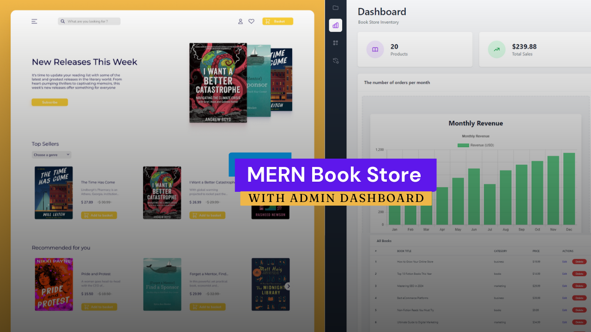

<p align="center">
  
</p>

<h1 align="center">BookReads</h1>

<p align="center">
  A full-stack MERN bookstore with browsing, cart &amp; checkout, Firebase authentication,
  and a JWT-secured admin dashboard for managing inventory and viewing sales analytics.
</p>

<p align="center">
  
  
  
  
  
  
  
</p>

---

## Table of Contents

- [Overview](#overview)
- [Features](#features)
- [Tech Stack](#tech-stack)
- [Project Structure](#project-structure)
- [Getting Started](#getting-started)
  - [Prerequisites](#prerequisites)
  - [1. Clone the repository](#1-clone-the-repository)
  - [2. Backend setup](#2-backend-setup)
  - [3. Frontend setup](#3-frontend-setup)
  - [4. Seed sample data](#4-seed-sample-data)
  - [5. Run the app](#5-run-the-app)
- [API Reference](#api-reference)
- [Available Scripts](#available-scripts)
- [Known Limitations](#known-limitations)
- [License](#license)
- [Author](#author)

## Overview

BookReads is an online bookstore built on the **MERN** stack (MongoDB, Express, React, Node.js).
Customers can browse books by category, view book details, add items to a cart, and place
orders. Admins get a separate, JWT-protected dashboard to manage the book catalog and view
store analytics (total orders, revenue, trending books, monthly sales chart).

The project is split into two independent apps:

- **`frontend/`** — a Vite + React single-page app styled with Tailwind CSS
- **`backend/`** — a REST API built with Express and MongoDB (Mongoose)

## Features

### Customer-facing

- 🏠 Home page with banner, top sellers carousel, recommended books, and category filtering
- 📖 Book detail pages with description, price, and category
- 🛒 Cart with add/remove items and live subtotal
- 💳 Checkout flow that creates an order (cash on delivery)
- 🔐 Authentication via Firebase (email/password **and** Google sign-in)
- 📦 Per-user order history page
- 🔒 Protected routes for cart/checkout/orders — unauthenticated users are redirected to login

### Admin-facing

- 🔑 Separate admin login secured with JWT (`/admin`)
- 📊 Dashboard with key metrics: total books, total sales, trending books, total orders
- 📈 Monthly revenue bar chart (Chart.js)
- ➕ Add new books with title, description, category, prices, and cover image
- ✏️ Edit existing books
- 🗑️ Delete books from inventory
- 📋 Manage Books table listing the entire catalog

## Tech Stack

**Frontend**
- React 18 + Vite
- Redux Toolkit & RTK Query (data fetching/caching)
- React Router v6
- Tailwind CSS
- Firebase Authentication
- React Hook Form, Swiper, Chart.js (`react-chartjs-2`), SweetAlert2, Axios

**Backend**
- Node.js + Express
- MongoDB + Mongoose
- JSON Web Tokens (`jsonwebtoken`) for admin auth
- bcrypt for password hashing
- CORS, dotenv

## Project Structure

```
BookReads/
├── backend/
│   ├── index.js                  # Express app entry point
│   └── src/
│       ├── books/                # Book model, controller, routes
│       ├── orders/                # Order model, controller, routes
│       ├── users/                 # Admin user model + login route
│       ├── stats/                 # Admin dashboard statistics route
│       ├── middleware/            # JWT verification middleware
│       └── seed/                  # Scripts to seed an admin user & sample books
└── frontend/
    └── src/
        ├── components/            # Navbar, Footer, Login, Register, AdminLogin...
        ├── pages/
        │   ├── home/               # Banner, TopSellers, Recommended, News
        │   ├── books/               # Book card, single book, cart, checkout, orders
        │   └── dashboard/            # Admin dashboard, add/edit/manage books, charts
        ├── redux/                  # Redux store, RTK Query APIs, cart slice
        ├── context/                # Firebase auth context
        ├── routers/                # App router + protected/admin route guards
        └── firebase/               # Firebase initialization
```

## Getting Started

### Prerequisites

- [Node.js](https://nodejs.org/) v18 or later and npm
- A [MongoDB](https://www.mongodb.com/cloud/atlas) database (Atlas free tier works great)
- A [Firebase](https://console.firebase.google.com/) project with **Email/Password** and
  **Google** sign-in providers enabled (Authentication → Sign-in method)

### 1. Clone the repository

```bash
git clone https://github.com/anagha2312/BookReads.git
cd BookReads
```

### 2. Backend setup

```bash
cd backend
npm install
```

Copy `.env.example` to `.env` and fill in your own values:

```bash
cp .env.example .env
```

```env
DB_URL=mongodb+srv://<username>:<password>@<cluster-url>/book-store?retryWrites=true&w=majority
JWT_SECRET_KEY=<a long random string, e.g. output of `openssl rand -hex 32`>
PORT=5000
```

### 3. Frontend setup

```bash
cd ../frontend
npm install
```

Copy `.env.example` to `.env` and fill in your Firebase web app config (found in
Firebase Console → Project Settings → General → Your apps):

```bash
cp .env.example .env
```

```env
VITE_API_BASE_URL=http://localhost:5000
VITE_API_KEY=...
VITE_Auth_Domain=...
VITE_PROJECT_ID=...
VITE_STORAGE_BUCKET=...
VITE_MESSAGING_SENDERID=...
VITE_APPID=...
```

### 4. Seed sample data

From the `backend/` directory (with `.env` configured and MongoDB reachable):

```bash
npm run seed:books   # populates the catalog with 20 sample books
npm run seed:admin -- <username> <password>   # creates/updates an admin account
```

The admin credentials you choose here are what you'll use to log in at `/admin`.

### 5. Run the app

In one terminal:

```bash
cd backend
npm run start:dev      # starts the API on http://localhost:5000
```

In another terminal:

```bash
cd frontend
npm run dev             # starts the app on http://localhost:5173
```

Visit `http://localhost:5173` for the storefront and `http://localhost:5173/admin`
for the admin login.

## API Reference

Base URL: `http://localhost:5000/api`

| Method | Endpoint                | Auth        | Description                          |
|--------|--------------------------|-------------|---------------------------------------|
| POST   | `/auth/admin`            | —           | Admin login, returns a JWT            |
| GET    | `/books`                  | —           | List all books                        |
| GET    | `/books/:id`              | —           | Get a single book by id               |
| POST   | `/books/create-book`      | Admin (JWT) | Create a new book                     |
| PUT    | `/books/edit/:id`         | Admin (JWT) | Update a book                         |
| DELETE | `/books/:id`              | Admin (JWT) | Delete a book                         |
| POST   | `/orders`                  | —           | Create an order                       |
| GET    | `/orders/email/:email`    | —           | Get orders placed by a given email    |
| GET    | `/admin`                   | Admin (JWT) | Dashboard stats (sales, orders, etc.) |

Admin-protected routes require an `Authorization: Bearer <token>` header with the JWT
returned from `/auth/admin`.

## Available Scripts

**Backend** (`backend/`)

| Script              | Description                              |
|---------------------|-------------------------------------------|
| `npm run start:dev` | Start the API with nodemon (auto-reload)  |
| `npm start`         | Start the API with node                   |
| `npm run seed:books`| Insert sample books if the collection is empty |
| `npm run seed:admin`| Create or update an admin user            |

**Frontend** (`frontend/`)

| Script           | Description                       |
|------------------|-------------------------------------|
| `npm run dev`    | Start the Vite dev server          |
| `npm run build`  | Build for production               |
| `npm run preview`| Preview the production build       |
| `npm run lint`   | Run ESLint                          |

## Known Limitations

- Cover images are referenced by filename and resolved from `frontend/src/assets/books/`
  — adding a book via the admin dashboard requires the image to already exist in that
  folder rather than uploading to cloud storage.
- Checkout is cash-on-delivery only; no payment gateway is integrated.
- Regular user authentication is handled entirely by Firebase on the client. The order
  history endpoint (`/api/orders/email/:email`) is not tied to a verified backend session,
  so it should not be relied on for sensitive data in a production deployment.

## License

This project is licensed under the [MIT License](LICENSE).

## Author

**[@anagha2312](https://github.com/anagha2312)**
